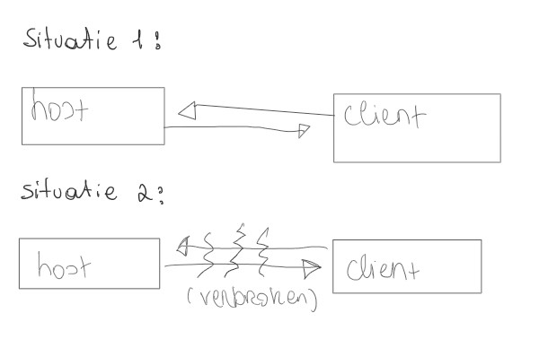
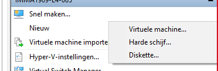
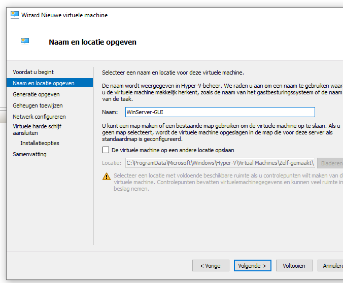
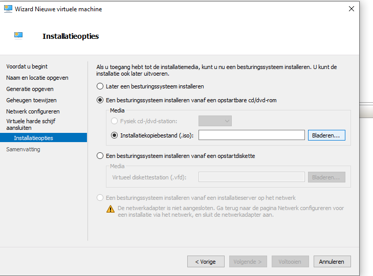
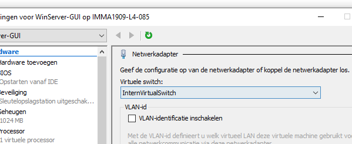
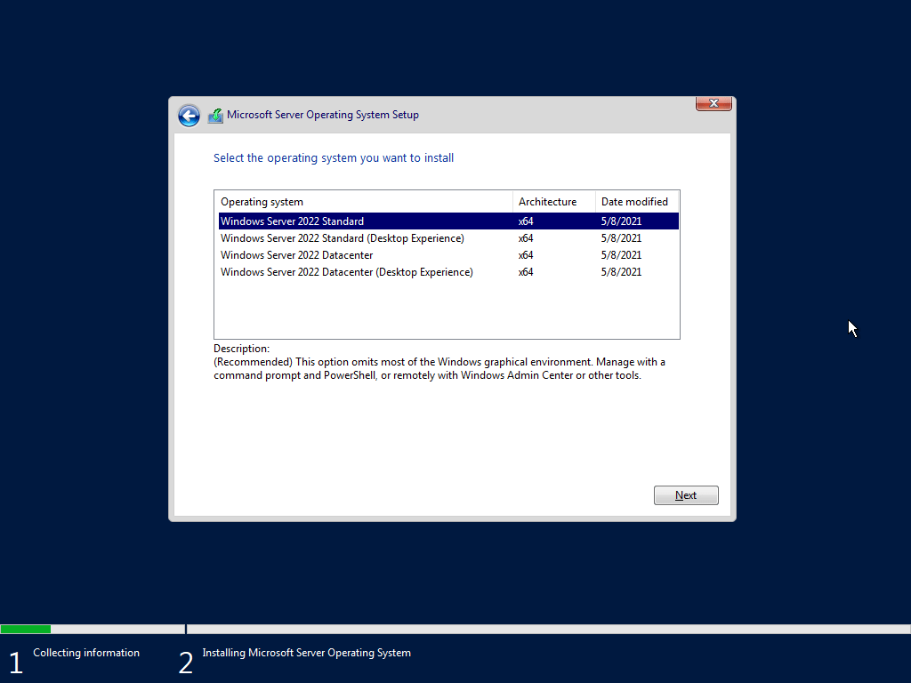

# Bestandsdelen met eigen laptop en VM Windows ser22
We hebben de opdracht gekregen voor een testopstelling te maken en door middel van WireShark te capturen. Hiervoor hebben de VM van Windowws server 2022 gebruikt en onze eigen laptop. We gaan WireShark pakketjes proberen te Capturen door een bestandeling op te zetten tussen de twee machines. Hieronder vindt u onze uitvoering.

## Testopstelling:
We maken gebruikt van 1 vituele machine met Windows server 2022 en met onze eigen laptop, de opstelling is alst volgt:

> wat extra informatie over de verbinding:
> Deze virtuele machine zijn verbonden met een privé switch. De netwerkdetectie en bestands- en printerdeling zijn op beide machines ingeschakeld. Het mapje Shares is openbaar gedeeld en is beveiligd met ntfs rechten. De gebruiker **Jos** Heeft toegang met het wachtwoord **UserPass01** tot deze map.

## Doel:
Het algemene doel van deze opdracht is gebruik kunnen maken van WireShark en ook begrijpen wat WireShark captured. Wij zelf hebben als doel gesteld dat we te weten willen komen wat je kan Capturen in WireShark als je een verbinding opzet of beëndigd met het protocol SMB `(Server Message Block)` Over 2 Windows machines.

## Hypothese:
Zoals de leerkracht heeft voorspeld zal er waarschijnlijk gebruik gemaakt van het protocol SMB, maar we zullen dit even opzoeken om te bekijken wat dit inhoud. SMB volgens het internet: Het protocol om bestandsdeling tussen Windows machines mogelijk te maken. Dit zal dus het protocol zijn dat gebruikt gaat worden, maar we weten niet nog welke pakketjes er weergegeven zullen worden in WireShark.
	

## Uitvoeren:
### 1.  Het opzetten van de proefopstelling:
	#### 1.  Downloaden van het ISO bestand:
	
				
		Om een virtuele machine met Windows Server 2022 aan te maken hebben we natuurlijk een ISO bestand nodig, 
		dit kunnen we vinden op de volgende website:
		[https://www.microsoft.com/en-us/evalcenter/evaluate-windows-server-2022](https://www.microsoft.com/en-us/evalcenter/evaluate-windows-server-2022)

		![Dit is een foto waarop je de downloadsite van Windows server 2022.][Fotos/downloadsite]
			
		Dan krijgen we deze opties, in ons geval selecteren we ISO, we zouden ook de VHD (harde schijf) kunnen selecteren, maar dat duurt veel langer om te downloaden.
					
		Dan vraagt de site om wat gegevens in te vullen, dit vul ik gewoon random in. En nu is hij aan het downloaden, dus kunnen we beginnen.
			
	#### 2.  Aanmaken van de Virtuele machine:
	
		We maken via de wizard van hyper-v een nieuwe virtuele machine aan:

		
		
		
	
		We geven deze een naam en selecteren daarna bij de installatieopties de ISO die we net hebben gedownload.
				
		Om de VM te verbinden met de pc maken we gebruik van een interne Virtuele Switch, dit zorgt ervoor dat de virtuele machine verbonden is met fysieke computer. De Interne Virtuele Switch maakt geen verbinding met het internet, maar die hebben we in dit geval ook niet nodig.

			
			
	#### 3.  Windows Server 22 Installeren.
			
		Nu starten we de virtuele machine op en krijgen we het scherm hieronder, dit wilt zeggen dat we goed zijn geboot van het ISO bestand en dat we nu onze Windows Server kunnen gaan installeren. Wij maken gebruik van de desktop versie, we zouden voor dit project eventueel de coreversie kunnen gebruiken.

			
			
	#### 4.  Instellingen van VM gereed maken voor bestandsdeling.
			
		Nu dat de VM volledig optimaal is zullen we enkel nog wat dingen moeten aanpassen, zodat bestandsdeling volledig optimaal werkt.
		Om hiermee wat te kunnen testen, maken we even een gedeelde map aan. Ook maken we een gebruiker aan die hier toegang tot heeft, in dit geval maken we de gebruiker **Jos** aan met het wachtwoord **UserPass01** 
		
		
		
		We delen de map en geven iedereen toestemming, de rechten stellen we in via ntfs rechten zodat enkel Jos toegang heeft tot deze map.
			
		Om bestandsdeling nu te kunnen activeren moeten we File Sharing aanzetten, als we gewoon naar het tabje netwerk in verkenner gaan krijgen we deze pop-up

		
			
		Als we op het gele balkje klikken dan kunnen we dit inschakelen. 
			
		Nu gaan we nog even de IP-adressen van de host en client aanpassen zodat deze in hetzelfde LAN `(local area network)` bereik zitten.
		We zoeken in de windows searchbalk Ncpa.cpl, dan dubbelklikken we op de enigste netwerkkaart die er is. We gaan verder naar details, en hier zouden we het internet Protocol Version 4 _(oftewel Ipv 4)_ terug moeten vinden. Standaard krijgt de VM een APIPA adres _(automatisch gegenereerd als er geen DHCP-server gevonden wordt)_, hiermee zouden we de opstelling eventueel ook kunnen werken maar om het onszelf makkelijker te maken gebruiken we een eigen ingesteld IP adres. 

		
			
		Het standaard IP adres is 192.168.0.? In dit geval gebruiken wij voor de Client 192.168.205.10. Het subnetmask is 255.255.255.0 _(dit is altijd hetzelfde)_,
		De VM is nu volledig inorde voor onze test.
			
	#### 5. Hosts
		
		Bij de host moet enkel het IP adres van de verbinding met de Virtuele Interne switch in dezelfde IP-range als die van de Client worden ingesteld.
		Dat doen we op dezelfde manier zoals bij de Client.

		 
			
			
	#### 6.  Controleren of alles werkt.
		
		Om te testen of er al een connectie is zullen we eerst even pingen van beide kanten, als dit al werkt kunnen we beginnen met het testen van de bestandsdeling. We pingen op de foto's van Client naar Host, maar merken iets op.

		**Client:**
		

		Op de Client krijgen we een Error, het pingen in het algemeen werkt niet. We zullen proberen dit op te lossen. Ik ben gaan kijken in de configuratie van het ipv4 protcol, ik heb van mezelf een fout ondekt, dit kan altijd gebeuren maar ik zal het even aanpassen. 

		
		
		

		Nu is het inorde.
		Dus we weten nu dat we van de Client naar Host kunnen pingen
			
		**Host:**	

				
		Deze werkte in het begin ook niet, dit was waarschijnlijk door de firewall regels van de Client, die heb ik even op private gezet zodat het nu wel werkt. In powershell via het commando get-NetConnetcionProfile heb ik eerst bekeken welk netwerkprofiel er ingesteld stond, dit stond ingesteld op public. Dit heb ik dan via Set-NetConnectionProfile -NetworkCategory private aangepast naar private.
		Nu checken we of bestandsdeling werkt.
		We krijgen een inlog aanvraag en zullen er nog niet op ingaan, zodat we direct dit moment kunnen Capturen via WireShark.
		We gaan er wel vanuit dat bestandsdeling werkt.

	### 2.  Het opzetten van de proefopstelling:
			
		#### 1.  Situatie 1:
			
			WireShark is geïnstalleerd op beide de Host en de Client hiermee zullen we weergeven welk protocol er gebruikt wordt tijdens het maken en het verbreken van de verbinding. In deze situatie maken we verbinding met de Client via bestandsdeling. Dit gaat als volgt:

			
			We hebben de eerste 2 keer opzettelijk fout ingelogd en zien hier een duidelijk gevolg van.
			Van de host krijgen we dit weergegeven:

			
			
			
			Van de client krijgen we dit:

			
			

			Dit is een closeup van de foute login gegevens van de Client:
			
			
	
			Nu zoeken we even uit wat dit allemaal inhoud:
			
			We hebben zelf een vermoede van wat deze gegevens willen zeggen. Volgens mij is het 1ste TCP pakketje een aanvraag om toegang te krijgen, het 2de TCP pakketje is een vraag vanuit de Client om in te loggen. Het 3de TCP pakketje zijn de inloggegevens vanuit de host naar de Client. Dan worden er een aantal controles uitgevoerd via het SMB/SMB2 protocol (Server Message Block) Dit wordt elke keer wanneer er een login poging is uitgevoerd. Het rode TCP pakket staat in dit geval voor een weigering van de toegang omdat het wachtwoord incorrect was. 
			
			Hieronder zie je bijvoorbeeld een foto van een correcte login:

			
			
			En hieronder zie je wat er gebeurd als er een excel bestand wordt aangemaakt.
						
			Geen officiële uitleg maar hypothese hoe het zou werken:  Wat er volgens mij gebeurd is dat er telkens een verzoek wordt gedaan om het mapje aan te maken of te vernieuwen. De naam zegt volgens mij al wat het doet, het stuurt gewoon over en weer wat er in het bestandje zit en als het aangepast wordt of er wordt een nieuw gemaakt dan zorgt het protocol ervoor dat dit ook gebeurd. Zoals je ziet is het gewoon een request om een bestand aan te maken en niet een bevel. Het protocol zorgt dus gewoon voor communicatie tussen host en server.
								
		#### 2.  Situatie 2:
			
			Verwachting: met het bekijken naar de vorige WireShark logs ga ik ervan uit dat tijdens dat we de verbinding verbreken er gewoon acces denied rode TCP pakketje zichtbaar zullen zijn/ verzonden worden
			
			Van beide host en client krijgen we dit weergegeven (linksonderaan staat de host en rechtsbovenaan):
			
			
			Dit is wat er gebeurd als je een sessie beëindigd er wordt dus een denie gestuurd: 
			Wat ons wel opviel is dat je nogal altijd toegang hebt en de sessie wordt dus vernieuwd. Het SMB protocol wordt tijdelijk stopgezet waardoor als je geen vernieuwing zou hebben van de sessie je dus gewoon (volgens ons in je cache geheugen) kan verder werken.

## Conclusie:
We kunnen hieruit concluderen dat het TCP-protocol wordt gebruikt om een verbinding te leggen en staande wordt gehouden en om de verbinding te verbreken. Het SMB(2) protocol wordt inderdaad toegepast om de bestanden up-to-date te houden, te bewerkingen door te voeren enz..  Dit kan je duidelijk zien in de screenshots van WireShark, na dat we deze testopstelling hebben uitgevoerd. Graag hadden we meer uitleg over de werking van SMB ookal hebben we volgens ons al een vrij waterdichte theorie.
